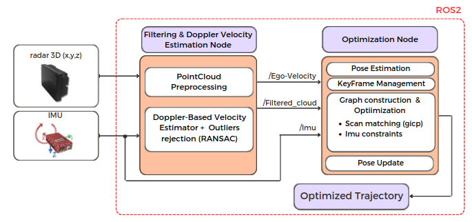

<a id="readme-top"></a>
<!-- PROJECT LOGO -->
<br />
<div>

# Loosely coupled 4D-Radar-Inertial Odometry for Ground Robots
</div>
<!-- TABLE OF CONTENTS -->
<details>
  <summary>Table of Contents</summary>
  <ol>
    <li>
      <a href="#about-the-project">About The Project</a>
    </li>
    <li>
      <a href="#getting-started">Getting Started</a>
      <ul>
        <li><a href="#system-requirements">System Requirements</a></li>
        <li><a href="#installation">Installation</a></li>
      </ul>
    </li>
    <li><a href="#tuning">Tuning</a></li>
  </ol>
</details>

<!-- ABOUT THE PROJECT -->
## About The Project

**Radar_Odom** is an open-source ROS2 Humble package designed to estimate the trajectory of a ground vehicle equipped with a 4D radar (x, y, z, Doppler) and an IMU. It is a 3D odometry system aimed at contributing to the development of odometry algorithms in adverse situations where commonly used sensors such as LiDAR, cameras, etc., are not applicable, for instance, in environments with fog or rain.

<p align="center">
  
</p>
<p align="right">(<a href="#readme-top">back to top</a>)</p>

The `Radar_Odom` package is structured around two main nodes that work together to estimate the vehicle's trajectory using radar and IMU data.

### 1. Filtering & Doppler Velocity Estimation Node
This node processes data from both the radar and the IMU. It performs several tasks:
- **PointCloud Preprocessing**: Prepares and filters the raw radar data.
- **Doppler-Based Velocity Estimation**: Estimates the vehicle's ego-velocity by leveraging the Doppler effect detected at radar points.
- **Outliers Rejection**: Uses techniques like RANSAC to detect and exclude non-physically feasible movements and dynamic objects (e.g., moving vehicles or pedestrians), ensuring only static elements contribute to the final velocity estimation.

### 2. Optimization Node
Once the radar and IMU data have been refined, this node handles:
- **Pose Estimation**: Using the ego-velocity and IMU data, the node estimates the vehicle's pose.
- **KeyFrame Management**: Manages key frames and ensures optimization over a sliding window.
- **Graph Construction & Optimization**: Builds and optimizes a graph of the vehicle's poses using scan matching (GICP) and IMU constraints.

This process ensures the vehicle's trajectory is continuously updated and optimized. The nodes work together to provide accurate pose estimation even in challenging environments where traditional sensors may not perform well.

<p align="right">(<a href="#readme-top">back to top</a>)</p>
## Getting Started

### System Requirements
- **Ubuntu 22.04 (Jammy)**
- **ROS2 Humble**

### Step 1: Install ROS2 Humble

Before you begin, make sure you have **ROS2 Humble** installed on your system. If you haven't installed it yet, you can follow the official ROS2 [installation guide](https://docs.ros.org/en/humble/Installation.html) for your platform. This guide will walk you through the steps necessary to set up the core ROS2 environment.

### Step 2: Install Required ROS2 Packages

In addition to the basic ROS2 installation, the following packages are needed for this project. These are typically included in a standard ROS2 setup, but it's always good to check if they are present on your system:

- `tf2_eigen`
- `pcl_conversions`
- `pcl_ros`
- `tf2_ros`
- `tf2_geometry_msgs`

You can install these packages using the following command if they are not already available on your system:
```bash
sudo apt install ros-humble-tf2-eigen ros-humble-pcl-conversions ros-humble-pcl-ros ros-humble-tf2-ros ros-humble-tf2-geometry-msgs
```
### Step 3: Install External Libraries

Besides the ROS2 packages, this project depends on several external libraries that you may need to install manually. These libraries include **Eigen3** for linear algebra operations, **Ceres Solver** for optimization, **PCL (Point Cloud Library)** for point cloud processing, and **OpenCV** for image and matrix operations.

To install these external libraries, simply copy and run the following command in your terminal:

```bash
sudo apt install libeigen3-dev libceres-dev libpcl-dev libopencv-dev || true
```
This command will install the necessary external dependencies, and if any of them are already installed, the installation process will simply ignore them and continue without issues.
<p align="right">(<a href="#readme-top">back to top</a>)</p>

### Installation

Follow these steps to install the `radar_odom` package:

1. **Clone the repository**

    ```bash
    mkdir radar_odom
    cd pose_slam
    git clone https://github.com/LuciaCoto/Radar_Odom.git .
    ```

2. **Build the package**:

    After cloning the repository and ensuring all the dependencies mentioned in the previous section are installed, build the package:

    ```bash
    colcon build
    ```

3. **Source your workspace**:

    After building, source your workspace to ensure the package is recognized:

    ```bash
    source install/setup.bash
    ```
4. **Launch the nodes**:

   Once the package is ready, you can launch the file, which initializes both nodes. The nodes will then remain active, waiting to receive data through the IMU and radar topics.
    ```bash
    ros2 launch radar_odom run.py
    ```
    

<p align="right">(<a href="#readme-top">back to top</a>)</p>


## Tuning

This section outlines the key parameters for configuring the radar-based odometry system. The configuration file is divided into two main nodes: `radar_pcl_processor` and `graph_slam`. Below is a brief description of the key parameters you can adjust:

### 1. **radar_pcl_processor Node**:

This node is responsible for processing radar and IMU data, estimating Doppler-based velocity, and filtering dynamic objects. Key parameters include:

- **IMU and Radar Topics**:
  - `imu_topic`: Specify the topic name where IMU data is published.
  - `radar_topic`: Specify the radar point cloud topic to process.

- **Vehicle Dynamics**:
  - `holonomic_vehicle`: Set to `true` for holonomic ground vehicles or `false` for non-holonomic ones.
  
- **Filtering Parameters**:
  - `distance_near_thresh` / `distance_far_thresh`: Defines the range of radar points to consider for processing.
  - `z_low_thresh` / `z_high_thresh`: Z-axis limits to filter out noise or irrelevant points based on height.

- **Dynamic Object Removal**:
  - `enable_dynamic_object_removal`: Enable or disable the removal of dynamic objects from the radar data. Setting this to `true` helps reject moving objects, like pedestrians or other vehicles.

The Doppler-based velocity estimator uses additional internal parameters for its operation (e.g., `doppler_velocity_correction_factor`, `allowed_outlier_percentage`), but these are set automatically based on system requirements and generally do not need manual tuning.

### 2. **graph_slam Node**:

This node handles the pose graph optimization using radar and IMU data, where keyframes are managed and graph optimization is performed.

- **IMU Bias**:
  - `bias_rpy`: Adjust the IMU bias for roll, pitch, and yaw angles, helping correct any drift or offset in the IMU data.

- **Keyframe Management**:
  - `keyframe_delta_trans`: The minimum translation (in meters) required between keyframes.
  - `keyframe_delta_angle`: The minimum rotation (in radians) required between keyframes.

- **Optimization Window**:
  - `max_window_size`: Defines the size of the sliding window for graph optimization, determining how many keyframes are optimized at once.
### 3. **Additional Calibration Considerations**:

In addition to the initial configuration of the parameters, it is important to set up the necessary transformations and calibrations between the IMU and radar sensors. These calibrations involve adjusting the sensor readings to align their reference frames. This can be done within the `pcl_processor` node, where transformations for the radar and IMU must be specified to ensure accurate velocity and pose estimation.

The current setup is adapted to the specific dataset NTU4DRadLM(https://github.com/junzhang2016/NTU4DRadLM.git) and includes transformations such as:
- IMU to radar frame transformations.
- Radar point cloud adjustments based on its mounting orientation and reference frame.

These transformations ensure that the data from each sensor is correctly aligned before processing.
  

## Acknowledgements

This work was supported by the grant INSERTION PID2021-127648OB-C31, funded by MCIN/AEI/ 10.13039/501100011033 and “European Union NextGenera-
tionEU/PRTR”.
<p align="">
  
</p>
<p align="right">(<a href="#readme-top">back to top</a>)</p>

